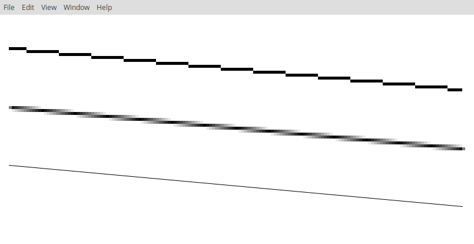

_Heute beschäftigen wir uns mit Antialiasing in der einfachten Form: Linien. Den Begriff Antialiasing hat sicher jeder schon einmal gehört, aber was genau bedeutet er? Kanten sollen weicher erscheinen? Hierfür betrachten wir zwei Algorithmen zum Zeichnen von Linien. Einer davon wird Linien ohne und der andere mit Antialiasing zeichnen.
In gleichen Zuge wollen wir uns direkt ein Framework zum Zeichnen anschauen und zwar [p5](https://p5js.org/). Im Laufe weiterer Aufgaben werden wir uns noch weitere Frameworks anschauen, jedoch werden wir meistens p5 benutzen. p5 ist einfach zu benutzen, wenn es darum geht primitive Formen, wie Linien, Rechtecke und Kreise, zu zeichnen._

### Eingabe

Keine Eingabe.

### Ausgabe

Das Programm soll eine Linie mit dem [Bresenham-Algorithmus](https://de.wikipedia.org/wiki/Bresenham-Algorithmus), eine Linie mit dem [Xiaolin Wus Linien-Algorithmus](https://de.wikipedia.org/wiki/Xiaolin_Wus_Linien-Algorithmus) und eine einfache Linie auf dem Canvas zeichnen.
Die Ausgabe sollte ungefähr aussehen wie unter Beispiele.

### Bonus 1

Um zu sehen, dass die Algorithmen wirklich schnell Linien zeichnen, sollen sich die Linien bewegen. Ob diese sich um ihr Zentrum drehen, ein Endpunkt der Linie sich im Kreis oder einfach nur auf und ab bewegt, ist euch überlassen. Hauptsache die Steigung der Linie ändert sich.

### Hinweise

- Die Doku für p5 findet ihr [hier](https://p5js.org/reference/).
- Außer der Doku dürft ihr natürlich auch im Slack-Channel Fragen zu p5 stellen.
- Es reicht für die Aufgabe, wenn ihr den Code aus den Wikipedia-Artikeln in Javascript übersetzt.
(Falls ihr dennoch Fragen zu den Algorithmen habt, dürft ihr diese in den Slack-Channel posten. Ich werde versuchen sie zu beantworten.)

### Beispiele

Eine mögliche Ausgabe des Programms:

